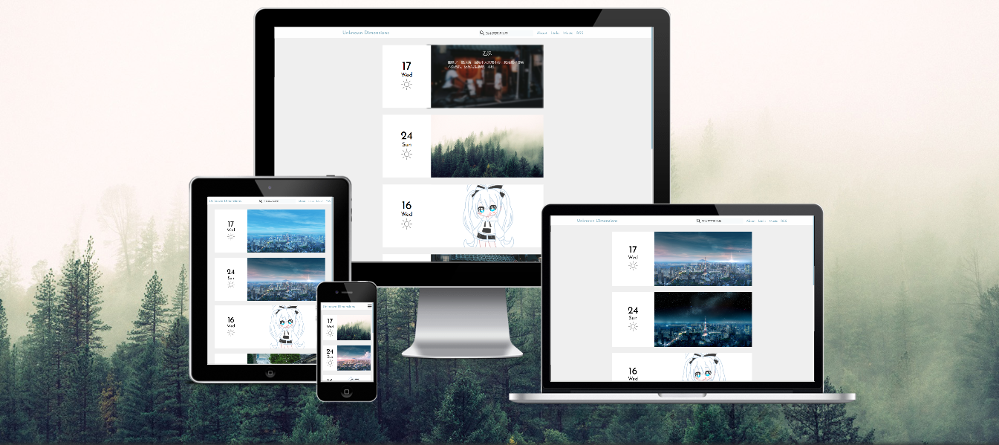

# Drary

A Typecho Theme

## 首页缩略图
自带10张缩略图
当文章又图时会用文章第一张图做缩略图
自定义缩略图 ：设置自定义字段的名称为 `img` 值则添加图片链接

## weather
首页天气默认 sunny 
设置自定义字段的字段名称为 `weather` ， 字符值为以下
+ cloudy day    -->  阴天
+ cloudy        -->  多云
+ lightning     -->  闪电
+ rain          -->  下雨
+ snowing       -->  下雪
+ storm         -->  暴雨
+ sunny         -->  晴天

## 引用金言的作者
```
!!!
<p class="author">作者</p>
!!!
```
## 友情链接
首先创建一个独立界面选择 Links
然后
```
 document.write('<div class="menu adsila">');
 link('链接1', '站点名1', '介绍1'); 
 link('链接2', '站点名2', '介绍2'); 
 link('链接3', '站点名3', '介绍3'); 
 link('链接4', '站点名4', '介绍4'); 
 document.write('</div>'); 
```
